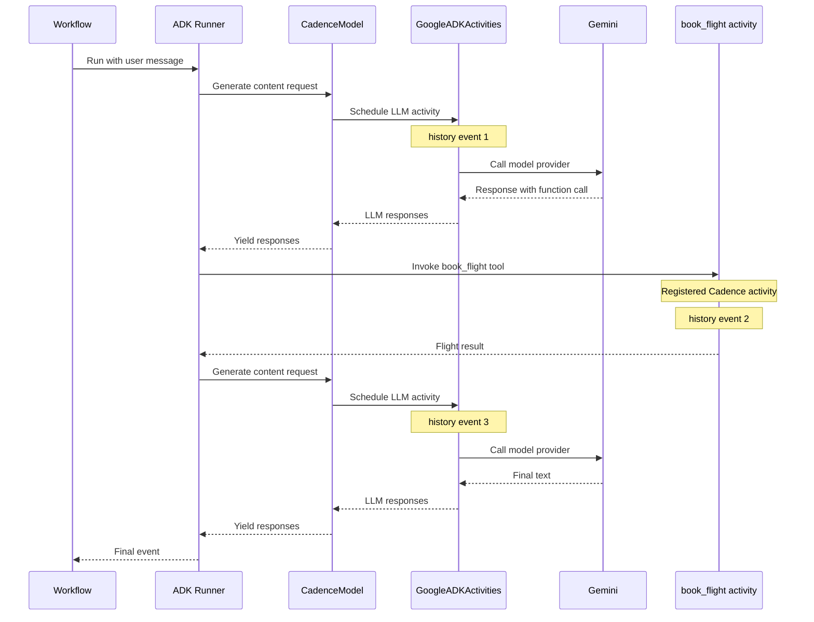

# Google ADK Integration with Cadence

## Durable Agent Execution

This module integrates with [Google Agent Development Kit (ADK)](https://github.com/google/adk-python) so ADK agents run as Cadence workflows. Every LLM call becomes a Cadence activity. Tools must be Cadence activities too if they perform side effects or need durable retries; ordinary ADK Python tools are not automatically converted into Cadence activities. ADK owns the agent loop, request construction, sessions, and events; Cadence owns durability, retries, and replay.

## Why Cadence

Cadence is a durable execution engine for long-running work. It gives ADK agents production-oriented execution semantics without moving agent behavior out of ADK:

- If a worker process crashes mid-run, Cadence can recover workflow state by replaying workflow history instead of restarting the agent from the beginning.
- Each activity, such as an LLM call, book flight, payment, or email, is a separate retried, timed, and observable unit in workflow history.
- Workflows can use timers, signals, queries, and versioning for runs that last hours or days, wait on humans, or coordinate with external systems.
- Cadence provides an operational model around task lists, workers, Cadence Web, and domain isolation for running orchestration in production.

ADK and Cadence operate at different layers: ADK defines the application and agent logic; Cadence provides durable infrastructure for executing that logic when processes fail, workloads scale, deployments happen, or auditability matters.

## What You Write

```python
# 1. Register the LLM activity once per worker.
registry.register_activities(GoogleADKActivities())

# 2. Register your tool as a normal Cadence activity.
@registry.activity(name="book_flight")
async def book_flight(from_city: str, to_city: str, ...) -> Flight: ...

# 3. Inside a @workflow.run method, create and run the ADK agent.
agent = LlmAgent(model="gemini-2.5-flash", tools=[book_flight], ...)
runner = CadenceAgentRunner(app_name="...", agent=agent, session_service=...)
async for event in runner.run_async(user_id=..., session_id=..., new_message=...):
    ...
```

`book_flight` keeps its normal Python signature. ADK uses the signature to build the tool schema, and the Cadence activity wrapper schedules the durable activity call when the tool is invoked from workflow code.

## How the Integration Works

`CadenceAgentRunner` is a thin wrapper around Google ADK's `Runner`. When it is created, it walks the ADK agent tree and replaces each `LlmAgent.model` string with a `CadenceModel`.

`CadenceModel` implements ADK's `BaseLlm` interface, so ADK continues to drive the normal agent loop. The difference is that `CadenceModel.generate_content_async` does not call the model provider directly. It schedules `GoogleADKActivities.generate_content_async` as a Cadence activity.

The activity runs outside workflow replay, reconstructs the real ADK model with `LLMRegistry.new_llm(model_name)`, performs the provider call, collects the non-streaming responses, and returns them to the workflow.

This keeps ADK responsible for agent behavior, sessions, tool planning, and events, while Cadence records each LLM call in workflow history and applies activity timeouts, retries, and durable execution.

Tools are not automatically converted into Cadence activities. If an ADK tool performs I/O, has side effects, or should be retried durably, register that tool function as a Cadence activity and pass the same callable to `LlmAgent.tools`.

Use `PydanticDataConverter` on the Cadence client because ADK request and response objects are Pydantic models that must cross the Cadence activity boundary.

## End-to-End Flow

This is the flow for one user message that causes one tool call and then a final model response:



## Example: Booking Flight Agent

A single agent with one tool. The tool is registered as a Cadence activity, then passed through to `LlmAgent` as a regular callable.

### Step 1: Write Agent as Cadence Workflow, tools as Cadence Activity (`book_flight_agent.py`)

```python

import cadence
from google.adk.agents import LlmAgent
from cadence.contrib.google_adk import CadenceAgentRunner, GoogleADKActivities
from google.adk.sessions import InMemorySessionService
from dataclasses import asdict, dataclass

cadence_registry = cadence.Registry()
cadence_registry.register_activities(GoogleADKActivities())

@cadence_registry.workflow(name="BookFlightAgentWorkflow")
class BookFlightAgentWorkflow:
    @cadence.workflow.run
    async def run(self, user_input: str) -> str:
        agent = LlmAgent(
            name="book_flight_agent",
            model="gemini-2.5-flash",
            instruction="Help the user book flights using the available tools.",
            tools=[book_flight],
        )

        runner = CadenceAgentRunner(
            app_name="book-flight",
            agent=agent,
            session_service=InMemorySessionService(),
        )

        info = cadence.workflow.WorkflowContext.get().info()
        session_id = info.workflow_id
        await runner.session_service.create_session(
            app_name=runner.app_name, user_id="user", session_id=session_id
        )

        final_text = ""
        async for event in runner.run_async(
                user_id="user",
                session_id=session_id,
                new_message=types.Content(
                    role="user",
                    parts=[types.Part.from_text(text=user_input)],
                ),
        ):
            if not event.is_final_response():
                continue
            if not event.content or not event.content.parts:
                continue
            for part in event.content.parts:
                if part.text:
                    final_text = part.text

        return final_text

@dataclass
class Flight:
    from_city: str
    to_city: str
    departure_date: str
    return_date: str
    price: float
    airline: str
    flight_number: str
    seat_number: str


@cadence_registry.activity(name="book_flight")
async def book_flight(
    from_city: str,
    to_city: str,
    departure_date: str,
    return_date: str,
) -> dict[str, str | float]:
    return asdict(
        Flight(
            from_city=from_city,
            to_city=to_city,
            departure_date=departure_date,
            return_date=return_date,
            price=100.0,
            airline="United",
            flight_number="123456",
            seat_number="12A",
        )
    )
```

The tool keeps its normal Python signature. ADK uses that signature to build the tool schema, while Cadence executes the registered function as an activity when it is called from workflow code.

### Step 2: Start Cadence Server

```sh
curl https://raw.githubusercontent.com/cadence-workflow/cadence/master/docker/docker-compose.yml | docker compose -f - up -d
```

### Step 3: Trigger the Agent Run

```python
# in main.py

import asyncio
import cadence
from datetime import timedelta
from cadence.api.v1.history_pb2 import EventFilterType
from cadence.contrib.google_adk import PydanticDataConverter
from book_flight_agent import cadence_registry
from cadence.api.v1.service_workflow_pb2 import GetWorkflowExecutionHistoryRequest

async def main() -> None:
    worker = cadence.worker.Worker(
        cadence.Client(
            domain="default",
            target="localhost:7833",
            data_converter=PydanticDataConverter(),
        ),
        "agent-task-list",
        cadence_registry,
    )

    async with worker:
        execution = await worker.client.start_workflow(
            "BookFlightAgentWorkflow",
            "Book a flight from New York to London on March 20th 2026 at 10:00 AM and return on March 25th, 2026 at 10:00 AM",
            task_list=worker.task_list,
            execution_start_to_close_timeout=timedelta(minutes=2),
        )

        print(
            f"cadence workflow started: "
            f"http://localhost:8088/domains/default/cluster0/workflows/"
            f"{execution.workflow_id}/{execution.run_id}/summary"
        )

        await worker.client.workflow_stub.GetWorkflowExecutionHistory(
            GetWorkflowExecutionHistoryRequest(
                domain=worker.client.domain,
                workflow_execution=execution,
                wait_for_new_event=True,
                history_event_filter_type=EventFilterType.EVENT_FILTER_TYPE_CLOSE_EVENT,
                skip_archival=True,
            )
        )


if __name__ == "__main__":
    asyncio.run(main())
```

### Step 4: See Agent Run in Cadence Web

Open the URL the workflow logged. Each LLM call appears as `GoogleADKActivities.generate_content_async` in the history; each tool call appears as `book_flight`. Each is independently retried by Cadence on failure.
