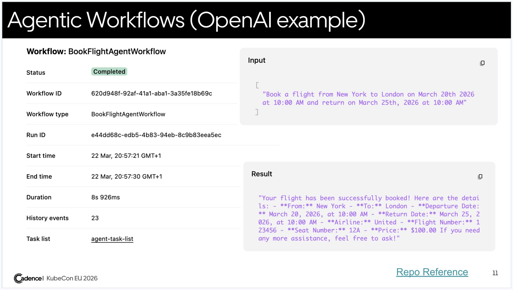

# OpenAI Agents SDK Integration with Cadence

We welcome contributions. Join [CNCF Slack Workspace](https://communityinviter.com/apps/cloud-native/cncf) and contact us in [#cadence-users](https://cloud-native.slack.com/archives/C09J2FQ7XU3).

## Durable Agent Execution

The module integrates with [OpenAI Agents SDK](https://github.com/openai/openai-agents-python) to allow users to run OpenAI agents in a durable way (retries, reset to a check point).

Currently, it only supports agents with function tools.

**Requirement** Python version 3.12+ is required. 

## Example: Booking flight Agent

The example below demonstrates how to run a single agent with one tool. See full code example [here](https://gist.github.com/shijiesheng/a06b6b58e44a9a09555bd3140370700e)

### Step 1: Write Agent as Cadence Workflow, tools as Cadence Activity (book_flight_agent.py)

```python
import cadence
from agents import Agent, function_tool, Runner, RunConfig
from cadence.contrib.openai import OpenAIActivities
from datetime import datetime
from dataclasses import dataclass

cadence_registry = cadence.Registry()
cadence_registry.register_activities(OpenAIActivities())

@cadence_registry.workflow(name="BookFlightAgentWorkflow")
class BookFlightAgentWorkflow:

    @cadence.workflow.run
    async def run(self, input: str) -> str:

        # define agent using OpenAI SDK as usual
        agent =Agent(
            name = "Book Flight Agent",
            model = "gpt-4o-mini",
            tools = [
                function_tool(book_flight),
            ],
        )
        result = await Runner.run(agent, input, run_config=RunConfig(
                tracing_disabled=True,
            ))
        return result.final_output

@dataclass
class Flight:
    from_city: str
    to_city: str
    departure_date: datetime
    return_date: datetime
    price: float
    airline: str
    flight_number: str
    seat_number: str

@cadence_registry.activity(name="book_flight")
async def book_flight(from_city: str, to_city: str, departure_date: datetime, return_date: datetime) -> Flight:
    """
    Book a flight tool: a pure mock for demo purposes
    """
    return Flight(from_city=from_city, to_city=to_city, departure_date=departure_date, return_date=return_date, price=100, airline="United", flight_number="123456", seat_number="12A")
```

### Step 2: Start Cadence Server

```sh
curl https://raw.githubusercontent.com/cadence-workflow/cadence/master/docker/docker-compose.yml | docker compose -f - up -d
```

### Step 3: Trigger the Agent Run
```python
# in main.py

import asyncio
import cadence
from datetime import timedelta
from cadence.api.v1.history_pb2 import EventFilterType
from cadence.contrib.openai import PydanticDataConverter
from book_flight_agent import cadence_registry
from cadence.api.v1.service_workflow_pb2 import GetWorkflowExecutionHistoryRequest

async def main():
    # start Cadence worker
    worker = cadence.worker.Worker(
        cadence.Client(
            domain="default",
            target="localhost:7833",
            data_converter=PydanticDataConverter(),
        ),
        "agent-task-list",
        cadence_registry,
    )

    # start BookFlightAgentWorkflow
    async with worker:
        execution =await worker.client.start_workflow(
            "BookFlightAgentWorkflow",
            "Book a flight from New York to London on March 20th 2026 at 10:00 AM and return on March 25th, 2026 at 10:00 AM",
            task_list=worker.task_list,
            execution_start_to_close_timeout=timedelta(minutes=10),
        )

        print(f"cadence workflow started: http://localhost:8088/domains/default/cluster0/workflows/{execution.workflow_id}/{execution.run_id}/summary")

        await worker.client.workflow_stub.GetWorkflowExecutionHistory(
            GetWorkflowExecutionHistoryRequest(
                domain=worker.client.domain,
                workflow_execution=execution,
                wait_for_new_event=True,
                history_event_filter_type=EventFilterType.EVENT_FILTER_TYPE_CLOSE_EVENT,
                skip_archival=True,
            )
        )

if __name__ == "__main__":
    asyncio.run(main())
```

### Step 4: See Agent Run in Cadence Web


